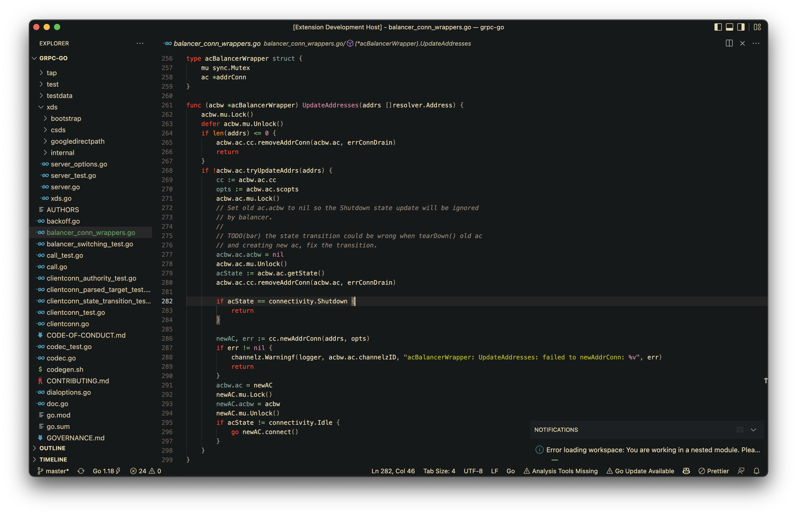
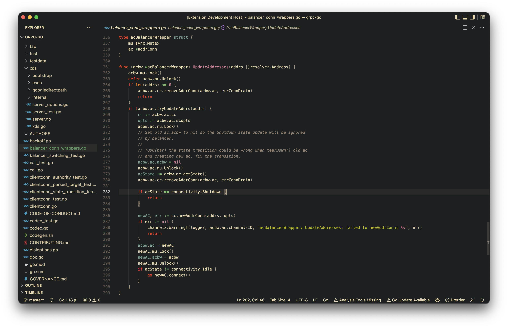
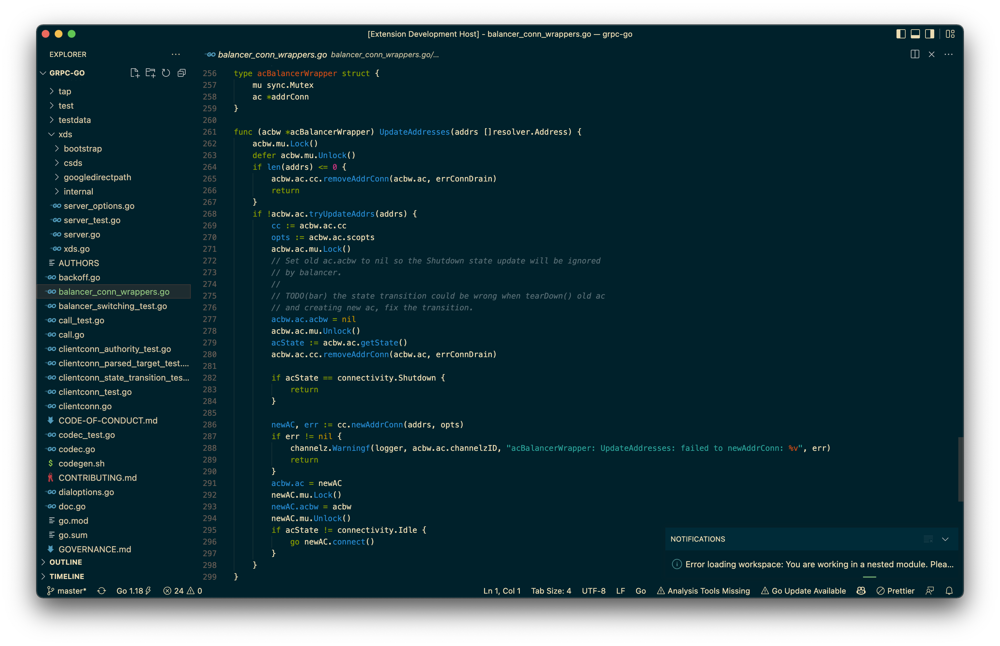
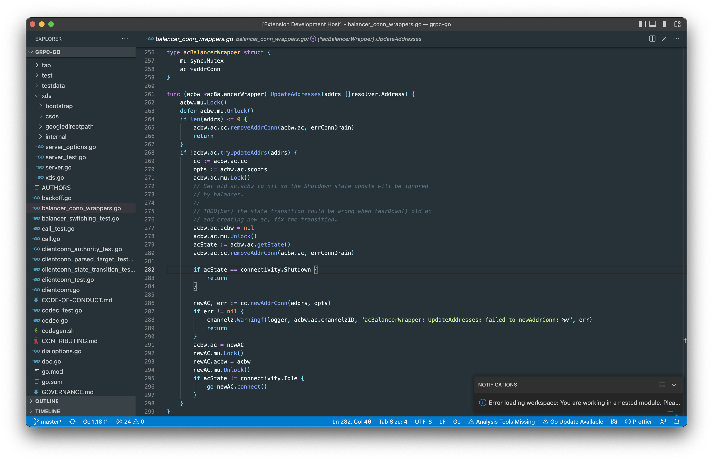

# 

---

Available on: https://marketplace.visualstudio.com/items?itemName=fadelpamungkas.necro-theme

Or install from Quick Open:

```context
ext install fadelpamungkas.necro-theme
```

Inspired by:

- [GitHub - morhetz/gruvbox: Retro groove color scheme for Vim](https://github.com/morhetz/gruvbox)

- [GitHub - jdinhify/vscode-theme-gruvbox: Gruvbox theme for vscode based on https://github.com/morhetz/gruvbox](https://github.com/jdinhify/vscode-theme-gruvbox)

- Default Solarized Dark VSCode Theme

Code inside the screenshot:

- [GitHub - grpc/grpc-go: The Go language implementation of gRPC. HTTP/2 based RPC](https://github.com/grpc/grpc-go)

### Necro theme



## Necrolighter theme



## Necrosolarized theme



## Necroblue theme


